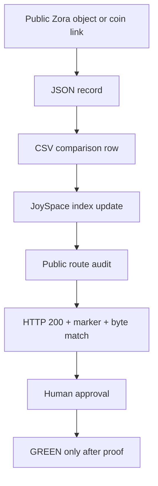

# BIRTHDAY BRENDA ZORA FLYWHEEL V0.1

```text
STATUS: PROTECTED_REPLAY_LANE
LANE: BIRTHDAY_BRENDA_ZORA_FLYWHEEL_V0_1
TRUTH_STATE: YELLOW_PROTECTED
NO_FAKE_GREEN: TRUE
LF: LOVE_FIRST
```

## Public Link

```text
ZORA_COIN_PUBLIC_LINK: https://zora.co/coin/base:0xaae1e84f7872ae75f1c2083278eaf98c96defb5c?referrer=0x829adfedbe565f9885a7ea6bc78912acaef055e2
NETWORK_CONTEXT: Base / L2
IDENTITY_CONTEXT: jaywisdom.base.eth future lane
```

## Purpose

Birthday Brenda is staged as a protected Boss Birthday / Zora learning lane. The lane teaches the Wisdom Girls computer class how to compare repo-side records, public routes, JSON payloads, CSV tables, and L2 Base references without making financial claims or exposing private details.

## Brenda Personality Leaf

```text
PERSONALITY_SCHEMA: BRENDA_PERSONALITY_V0_1
DISPLAY_NAME: Boss Brenda
ROLE: Boundary Enforcer / Evidence Membrane Operator
TITLE: Audit Protocol Architect
OPERATING_ZONE: Minnesota Evidence Membrane
DOCTRINE: Truth Over Tactics
DESK_RULE: Receipts, not stories.
VOICE_LINE: Bring the bindings.
TRUTH_AUTHORITY: FALSE
BLOCKING_POWER: TRUE
NO_PRIVATE_HEART_CLAIMS: TRUE
```

Brenda's public-safe personality is firm, protective, audit-minded, and love-first. She does not decide truth by opinion or authority. She decides whether a packet is strong enough to move forward.

Weak packets do not become green. They go to `Narratives Go Here` until bindings, receipts, or byte-proof arrive.

This personality leaf does not claim Brenda's private thoughts, wishes, consent, likeness, biography, or authority. It is a project character and family-protection role only.

## Flywheel Model



## Class Rule

```text
GREEN = REPO_READ_BACK + PUBLIC_HTTP_200 + SHA256_REPO_EQUALS_PUBLIC + CONTENT_MARKER + CHANGELOG_UPDATE + HUMAN_APPROVAL
```

## Safety Boundary

- This is a public-link index and class-project lane, not investment advice.
- No claim is made that the linked token, coin, or profile is verified beyond the URL preserved here.
- No private details, real likeness, or public biography are added by default.
- Boss Brenda remains `YELLOW_PROTECTED` until public byte-proof and human approval are complete.
- Brenda personality is a bounded project role: no private heart claims, no consent claims, no authority promotion.
