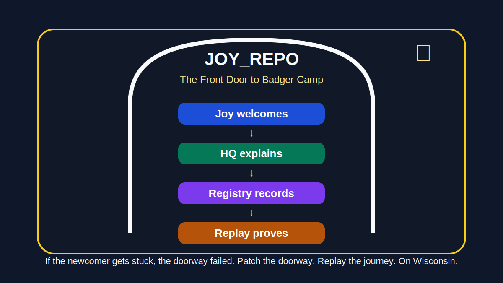

# JOYSPACE 🌈🧾

**JOYSPACE** is a family-safe digital garden, witness layer, and continuity layer for Wisdom Replay Systems.

## 🚪 Start Here — Badger Camp Front Porch

**Immediate path for any stranger:**

- **[JOY_REPO.md](JOY_REPO.md)** — The cultural front door: what is this place?
- **[BADGER_CAMP_HQ.md](BADGER_CAMP_HQ.md)** — Orientation hub: where to go next
- **[quests/GENESIS_REPLAY_001.md](quests/GENESIS_REPLAY_001.md)** — First quest card: prove you can play



**JOY_REPO is the front door to Badger Camp.**

It is the cultural layer that welcomes people into the system before they encounter documentation, receipts, and replay exercises.

---

It began as a 2026 Gen Z JoySpace page and now opens as a family-business memory surface for the full Wisdom Family.

**Role:** Witness Layer  
**Family Business:** Wisdom Replay Systems  
**Layer:** JoySpace / Living Ledger / Family Continuity / Game Night  
**Motto:** The future should feel exciting, not frightening.

---

## What JoySpace Is 🌈

JoySpace is the open, welcoming surface of JOY.

It helps family members and new builders:

- start small
- stay safe
- build creatively
- preserve memory
- earn gentle badges
- celebrate growth
- keep the joy

JoySpace is not command-and-control.

JoySpace is a garden.

```text
Build a world where kindness is code and truth is open.
```

---

## JoySpace First Actions

```text
1. Open the Badge Picker.
2. Choose one badge that feels safe.
3. Make one tiny proof.
4. Keep it private, family-only, or shareable.
5. Celebrate gently.
6. Record only what should be remembered.
```

Start here:

```text
badges/guides/guide_onboarding_v0_1.md
badges/guides/badge_picker_v0_1.md
badges/guides/guide_privacy_v0_1.md
badges/service_catalog_v0_1.md
```

---

## JoySpace Badges 🪴🛡️💛🌈

JoySpace badges invite growth without ranking people.

```text
Seed Planter      -> begin your Digital Garden
Future Protector  -> learn safety
Growth Guardian   -> reflect and grow
Joy Bringer       -> brighten someone's day
Kindness Keeper   -> practice care
```

Badge doctrine:

```text
Badges invite.
Evidence exists.
Witnesses confirm existence.
Awards celebrate participation.
Authority remains false.
```

---

## JoySpace Play Layer 🎲

The repo can be explored like a friendly game, but the game never controls the people.

Soft controls:

```text
Grow       -> choose a badge or skill
Rest       -> pause and keep private
Reflect    -> write one sentence
Share      -> only if safe and consented
Commit     -> preserve a receipt
Privacy    -> run the privacy guide
Replay     -> read the Living Ledger
Cozy       -> lower the stack
```

Core rule:

```text
JoySpace guides choices.
JoySpace does not control people.
Authority remains false.
```

---

## Three Sisters Gaming Algorithms 🌳🎲

The Three Sisters Gaming Algorithms make JoySpace playable while keeping the family barrier intact.

```text
Sister One   -> Protect the memory
Sister Two   -> Keep the joy moving
Sister Three -> Choose the next safe action
```

---

## Super Secret Sister Syntax

JOY now includes a playful sister-language layer for Wisdom Girls, family-safe participation, kindness, memory, and receipt-based verification.

See: docs/SUPER_SECRET_SISTER_SYNTAX.md

Core rule:

Joy first.
Receipts second.
Authority never.

---

## ALMS to JOY Bridge

JOY now includes a bridge from verifiable ALMS receipts into family-safe JOY stories.

See: docs/ALMS_TO_JOY_BRIDGE.md

Core rule:

Stories are allowed.
Fabrication is not.
Authority remains false.
