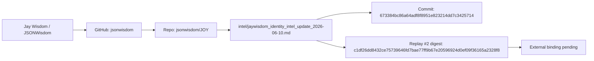

# Intel Graph Correction — 2026-06-10

## Purpose

Correct false negatives and overclaims in an external intelligence graph report about Jay Wisdom / JSONWisdom.

This correction is repo-backed and should be treated as the current GitHub lane source until superseded by stronger direct evidence.

## Verified Through Connected GitHub

| Fact | Status |
|---|---|
| GitHub login `jsonwisdom` exists | VERIFIED |
| Repo `jsonwisdom/JOY` exists | VERIFIED |
| Repo visibility is public | VERIFIED |
| Authenticated operator has admin/push access | VERIFIED |
| Default branch is `main` | VERIFIED |
| File `intel/jaywisdom_identity_intel_update_2026-06-10.md` exists on `main` | VERIFIED |
| Commit creating the intel update was returned as `673384bc86a64adf8f8951e823214dd7c3425714` | VERIFIED BY GITHUB WRITE RESPONSE |

## False Negatives In External Report

```txt
CLAIM: jsonwisdom/JOY repo not found
STATUS: FALSE
CORRECTION: repo exists, public, active, default branch main

CLAIM: no direct link to jsonwisdom/JOY repo found
STATUS: FALSE FOR CONNECTED GITHUB LANE
CORRECTION: file fetch confirmed repo and artifact path

CLAIM: commit 673384b... has no public match
STATUS: FALSE OR UNRESOLVED BY THEIR SEARCH METHOD
CORRECTION: GitHub create_file returned full commit SHA 673384bc86a64adf8f8951e823214dd7c3425714

CLAIM: GitHub user only likely exists via Devpost
STATUS: INCOMPLETE
CORRECTION: authenticated GitHub login is jsonwisdom
```

## Facts Still Not Crowned

The GitHub correction does not automatically verify these external lanes:

```txt
EAS_ATTESTATION_HISTORY = STILL_PENDING_DIRECT_LOOKUP
ENS_CURRENT_RESOLVER = STILL_PENDING_REFRESH
BASENAME_CURRENT_RESOLVER = STILL_PENDING_REFRESH
ZORA_FACTORY_OBJECT = STILL_PENDING_DIRECT_LOOKUP
GPK_SECRET_FACTORY_OBJECT = STILL_HYPOTHETICAL_OPEN
WALLET_0x38f52288...OWNERSHIP = STILL_PENDING_DIRECT_SIGNATURE_OR_RESOLUTION
WALLET_0x694cE46C...OWNERSHIP = STILL_PENDING_DIRECT_SIGNATURE_OR_RESOLUTION
```

## Corrected Master Graph Segment



## Current Corrected State

```txt
GITHUB_REPO_FOUND = TRUE
GITHUB_REPO_PUBLIC = TRUE
GITHUB_OPERATOR_ACCESS = TRUE
INTEL_FILE_PRESENT = TRUE
INTEL_COMMIT_RECORDED = TRUE
REPLAY_2_DIGEST_RECORDED = TRUE
EXTERNAL_BINDING = PENDING
ON_CHAIN_PROOF = PENDING
NO_FAKE_GREEN = ACTIVE
```

## Next Lawful Action

The next highest-value move is to build a GitHub artifact index from the actual `jsonwisdom/JOY` repository, then use that index to recover PR numbers, UIDs, commit SHAs, replay vectors, and EAS references already present in repo history.

Do not rely on public search summaries for GitHub existence when connected GitHub access is available.
